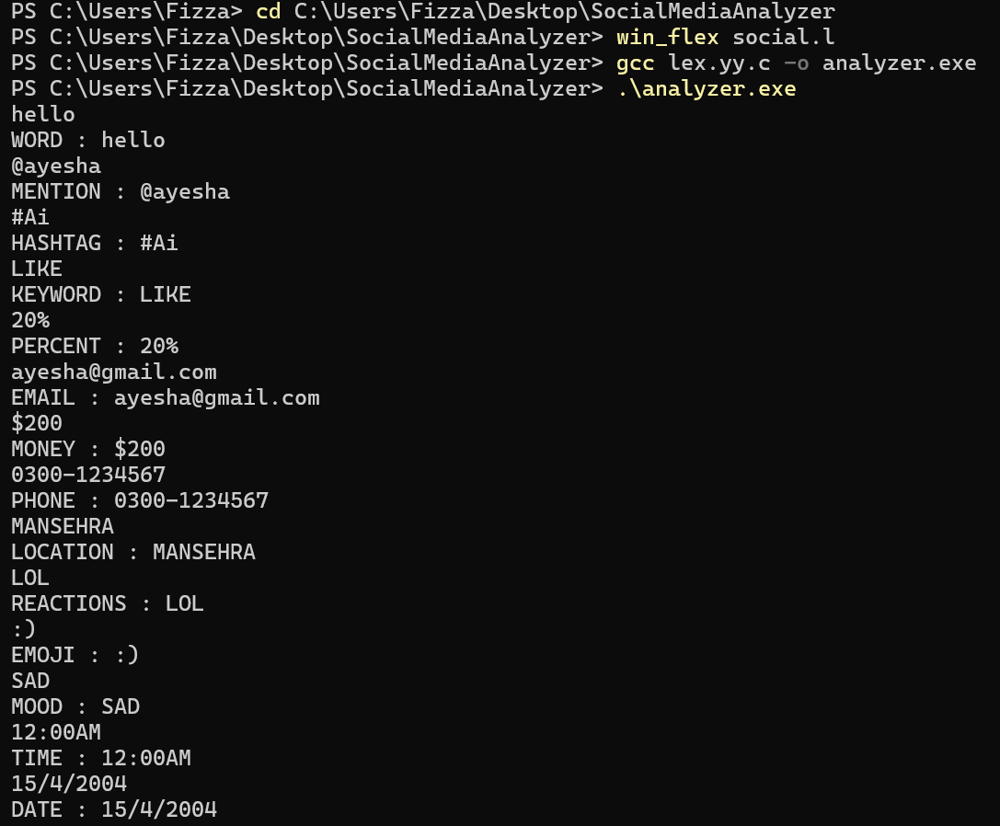

# Social Media Content Lexical Analyzer

## Overview

This project is a lexical analyzer developed using **Win_Flex** and **C language**.

It recognizes different types of social media tokens using Regular Expressions (Regex).

## Features

- Keywords
- Hashtags
- Mentions
- Emails
- Numbers
- Words
- Emojis
- Dates
- Time
- Locations
- Moods
- Reactions
- Phone Numbers
- Percentages
- Money 
- Token Summary Generation

## Tools Used

- Win_Flex
- GCC Compiler
- C Language
- Visual Studio Code

## Sample Output

  

## Compiler Phase

This project implements the **Lexical Analysis** phase of a compiler.
